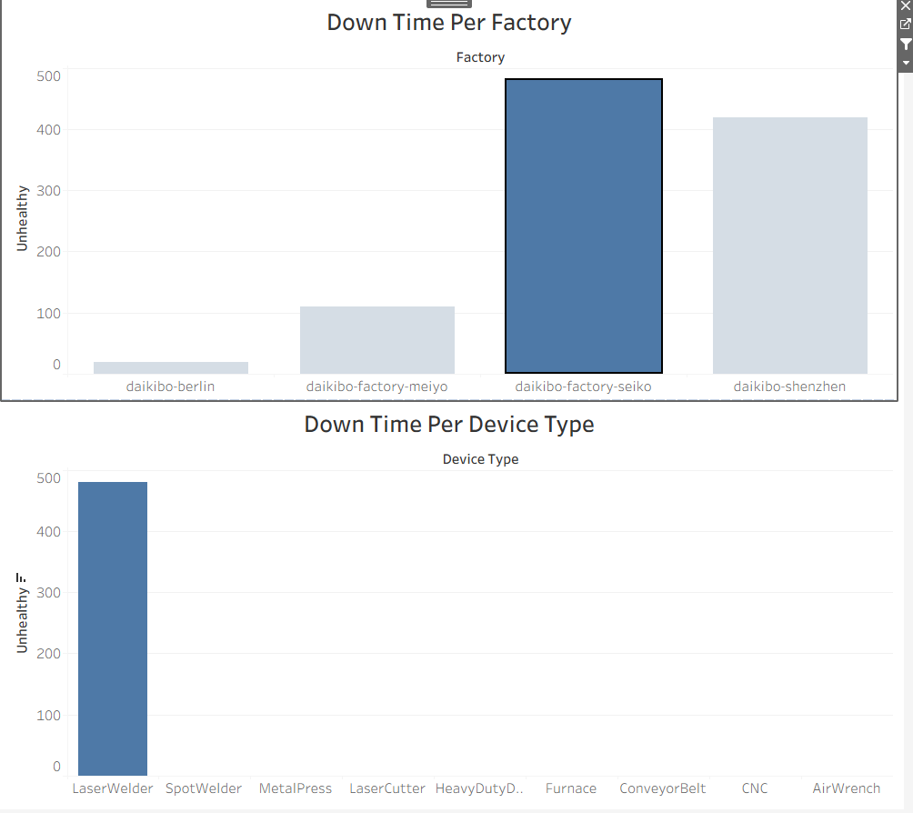

# deloitte-data-analytics-simulation
Deloitte Australia Data Analytics Job Simulation project involving Excel-based classification and dashboard insights.

# Deloitte Australia Data Analytics Job Simulation

## Overview

This project is based on the Deloitte Australia Data Analytics Virtual Internship on Forage. It focuses on analyzing employee equality data and generating business insights.

## Objectives

* Analyze equality scores across job roles and factories
* Classify scores for better understanding
* Present insights using simple visualization

## Work Done

* Used Excel to clean and analyze data
* Classified equality scores into categories
* Created a dashboard-style visualization

## Tools Used

* Microsoft Excel

## Dataset

* Factory
* Job Role
* Equality Score (-100 to +100)

## Files

* data/Equality_Table.xlsx
* visuals/dashboard.png

## Dashboard Preview

## Conclusion

This project shows my ability to analyze data, classify it, and present insights clearly using Excel.

